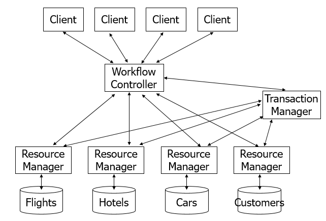

# DDB_Travel_System
DDB course project: 分布式旅游预订系统


# 1 要求
## 1.1 系统概述

- 资源管理器(Resource Manager)‏
    - 数据操作：查询、更新(插入，删除) 数据，提供对资源访问的封装，完成对数据的实际访问和数据持久化
- 事务管理器(Transaction Manager)‏
    - 提供事务管理功能，保证事务的ACID特性
- 流程控制器(Workflow Controller)‏
    - 客户端看到的整个系统的调用接口，使系统的其它部分如TM,RM和实际的数据表对客户端透明

## 1.2 数据定义
- 系统存储以下五张表
    - FLIGHTS(flightNum, price, numSeats, numAvail)‏
    - HOTELS(location, price, numRooms, numAvail)‏
    - CARS(location, price, numCars, numAvail)‏
    - CUSTOMERS(custName)‏
    - RESERVATIONS(custName, resvType, resvKey)‏
- 关于数据的一些假设，简化系统数据库模式设计
    - 每个地点(localtion)只有一个旅馆和租车行
    - 只有一个航空公司
    - 一个航班上所有座位的价格相同
    - 同一地点所有房间和车价格相同

## 1.3 数据操作

- 航班
    - 添加新航班
    - 给航班增加座位
    - 取消航班
    - 查询航班上的剩余座位数
    - 查询航班价格
    - 为客户预定航班的座位
- 租车和旅馆数据有着类似操作
- 需要实现的操作在接口文件WorkflowController.java中描述

## 1.4 分布式事务管理
实现 TransactionManager and ResourceManager

# 2. 项目介绍
## 2.1 文件介绍
- assets: 一些素材。
    - img: 图片
- doc: 一些文档：教程，笔记
- src: 项目源码
    - lockmgr: 锁管理器
    - test.part2: 测试文件
    - transaction: 分布式事务系统实现
- run_test.sh: the script to run auto test.
- run_server.sh: the script to run server only.
- run_simple_client.sh: the scripts to run a simple client to test server.
- README: this file.

## 2.2 运行与测试
### 2.2.1. 环境：
tested on Ubuntu 16.04 with openjdk version "1.8.0_212".

简单介绍：服务地址为localhost:port/RMIName. port 配置为 3345，可以在src/transaction/Makefile 下修改。3345一般空闲，可以不改。
RMIName 为各个服务例如WC,TM,RMs 的名字，涉及文件较多，建议不要修改。
### 2.2.2. 运行服务:
切换到根目录：DDB_PJ/, 然后执行脚本
```bash
sudo bash run_server.sh
```
该脚本会启用WC,TM和所有的RM.
启动新的窗口，然后可以运行src/transaction/SimpleClient.java简单测试服务。启动命令：
```bash
sudo bash run_simple_client.sh
```
建议使用linux环境，如非 Ubuntu，命令可能略有不同，打开脚本自行修改。
### 2.2.3. 运行自动化测试:
可以采用编写的测试环境执行自动化测试，参考：[https://www.ics.uci.edu/~cs223/projects/projects2.html](https://www.ics.uci.edu/~cs223/projects/projects2.html).

简单介绍：
目录为src/test.part2
- results: 各个测试案例测试结果. 已经包含一部分案例的正确测试结果，提供参考。
- scripts: 所有的测试案例。格式如下：
```text
第一行：使用线程数。
# 接下来是测试命令
线程id 命令 参数
```
demo:
```text
1
1 call start
1 return
1 exit
```
具体使用可以查看其它测试案例，可以结合src/transaction/Client.java 查看执行逻辑。

运行自动测试：切换到根目录DDB_PJ, 运行测试脚本：
```bash
sudo bash run_test.sh
```
如果修改了src/transaction/Makefile 里配置的端口，请打开 run_test.sh 对应修改。
测试结果会写到results目录下对应的文件里。运行脚本会有一些异常，一些常见的异常可以打开脚本
查看注释。

编写测试用例：
- 打开MASTER.xml添加测试用例的名字，如下
```xml
<test id="test case name">
    some description: test purpose or the most likely reason of the failure of the test.
</test>
```
- 在scripts目录下添加id对应文件名的测试用例。    